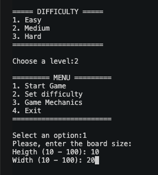
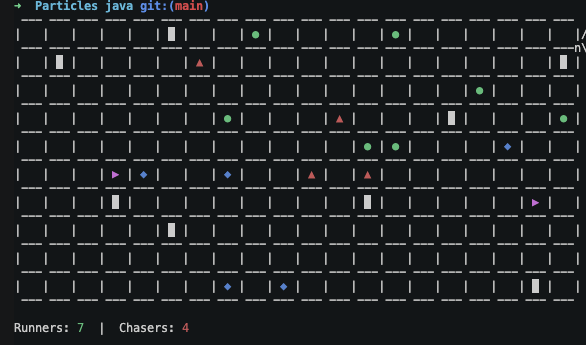

<h1 align="center">PARTICLES</h1>

<p align="center"><strong>A turn-based simulation game on a 2D grid where Runners try to survive while Chasers hunt them.</strong></p>

## 🌐 Web Expansion

- This project has an extended web version deployed in this repository: [mpjmar/Particles](https://github.com/mpjmar/Particles) (SSH: `git@github.com:mpjmar/Particles.git`).

---

### 🎮 Overview

<p align="center">
	
	
</p>

PARTICLES is a console-based Java game where autonomous entities interact on a board:

- Runners (`●`) avoid nearby Chasers.
- Chasers (`▲`) pursue the closest Runner.
- Healers (`◆`) restore Runner life when adjacent.
- Speeders (`▶`) grant temporary speed boosts to Chasers.
- Obstacles (`█`) block movement.

The game ends when one side is eliminated or when the turn limit is reached.

### ⚙️ Core Mechanics

| Element | Behavior |
| --- | --- |
| Runner | Detects Chasers within distance 5 and moves away from threat. |
| Chaser | Targets nearest Runner and moves to close distance. |
| Fight | If a Chaser is adjacent to its target Runner, both lose life equal to the opponent's current life. |
| Healer | Adjacent Runner receives extra life, then the Healer is removed. |
| Speeder | Adjacent Chaser gains 5 boosted turns (2 movement steps per turn), then the Speeder is removed. |

### 🔄 Turn Flow

Each iteration of the loop runs this order:

1. Move all entities (`Movements`).
2. Resolve nearby combat (`Fight`).
3. Apply healing pickups (`Heal`).
4. Apply speed pickups (`Speed`).
5. Remove dead roles and print updated board/state.

### 🧩 Difficulty

Difficulty affects generation density:

- Level 1 (Easy): lower density of board elements.
- Level 2 (Medium): medium density.
- Level 3 (Hard): higher density.

For obstacles, runners and chasers the max amount scales approximately with total cells divided by `20`, `15`, `10` for levels `1`, `2`, `3`.

### 🗂️ Project Structure

```text
src/
	Play.java                # Entry point and game menu
	board/
		Board.java             # 2D board representation
	boardElements/
		BoardElement.java      # Base type for all board entities
		Role.java              # Life-based entities (Runner, Chaser)
		Runner.java
		Chaser.java
		Healer.java
		Speeder.java
		Obstacle.java
	gameActions/
		Game.java              # Orchestrates one game turn
		Fight.java
		Heal.java
		Speed.java
	generator/
		ElementsGenerator.java # Random element generation by difficulty
	strategies/
		Movements.java
		RunnerStrategy.java
		ChaserStrategy.java
	utils/
		Utils.java
		ListUtils.java
		MovUtils.java
		Position.java
```

### ▶️ How to Run

Requirements:

- JDK 16+ (pattern matching with `instanceof` is used).

Compile from project root:

```bash
mkdir -p bin
find src -name "*.java" -print0 | xargs -0 javac -d bin
```

Run:

```bash
java -cp bin Play
```

### 🕹️ In-Game Configuration

Menu options:

1. Start game.
2. Set difficulty (`1` to `3`).
3. Show mechanics.
4. Exit.

Board size input is validated in range `10` to `50` for both height and width.

### 🏁 Win Conditions

The simulation ends when:

- All Runners are dead, or
- All Chasers are dead, or
- 50 consecutive turns pass without any role being removed.

At the end, the side with more survivors is declared the winner.

---

## 🌐 Expansion Web

- Este proyecto tiene una ampliacion en version web desplegada en este repositorio: [mpjmar/Particles](https://github.com/mpjmar/Particles) (SSH: `git@github.com:mpjmar/Particles.git`).

### 🎮 Descripcion General

PARTICLES es un juego de consola en Java donde entidades autonomas interactuan sobre un tablero:

- Los Runner (`●`) intentan escapar de los Chaser cercanos.
- Los Chaser (`▲`) persiguen al Runner mas cercano.
- Los Healer (`◆`) curan vida a Runner adyacentes.
- Los Speeder (`▶`) dan velocidad temporal a Chaser adyacentes.
- Los Obstacle (`█`) bloquean el movimiento.

La partida termina cuando un bando se elimina o cuando se alcanza el limite de turnos.

### ⚙️ Mecanicas Principales

| Elemento | Comportamiento |
| --- | --- |
| Runner | Detecta Chaser a distancia 5 y se mueve alejandose de la amenaza. |
| Chaser | Selecciona al Runner mas cercano y se mueve para reducir distancia. |
| Fight | Si un Chaser esta adyacente a su Runner objetivo, ambos pierden vida igual a la vida actual del oponente. |
| Healer | Un Runner adyacente recibe vida extra y el Healer desaparece. |
| Speeder | Un Chaser adyacente obtiene 5 turnos potenciados (2 pasos por turno) y el Speeder desaparece. |

### 🔄 Flujo de Turno

Cada iteracion del bucle se ejecuta en este orden:

1. Movimiento de entidades (`Movements`).
2. Resolucion de combate cercano (`Fight`).
3. Aplicacion de curacion (`Heal`).
4. Aplicacion de velocidad (`Speed`).
5. Eliminacion de roles muertos e impresion de tablero/estado.

### 🧩 Dificultad

La dificultad afecta la densidad de generacion:

- Nivel 1 (Facil): menor densidad de elementos.
- Nivel 2 (Medio): densidad intermedia.
- Nivel 3 (Dificil): mayor densidad.

Para obstaculos, runners y chasers, la cantidad maxima escala aproximadamente con el total de celdas dividido por `20`, `15`, `10` para niveles `1`, `2`, `3`.

### 🗂️ Estructura del Proyecto

```text
src/
	Play.java                # Punto de entrada y menu principal
	board/
		Board.java             # Representacion del tablero 2D
	boardElements/
		BoardElement.java      # Tipo base para entidades del tablero
		Role.java              # Entidades con vida (Runner, Chaser)
		Runner.java
		Chaser.java
		Healer.java
		Speeder.java
		Obstacle.java
	gameActions/
		Game.java              # Orquesta un turno de juego
		Fight.java
		Heal.java
		Speed.java
	generator/
		ElementsGenerator.java # Generacion aleatoria segun dificultad
	strategies/
		Movements.java
		RunnerStrategy.java
		ChaserStrategy.java
	utils/
		Utils.java
		ListUtils.java
		MovUtils.java
		Position.java
```

### ▶️ Como Ejecutarlo

Requisitos:

- JDK 16+ (se usa pattern matching con `instanceof`).

Compilar desde la raiz del proyecto:

```bash
mkdir -p bin
find src -name "*.java" -print0 | xargs -0 javac -d bin
```

Ejecutar:

```bash
java -cp bin Play
```

### 🕹️ Configuracion en el Menu

Opciones disponibles:

1. Iniciar partida.
2. Elegir dificultad (`1` a `3`).
3. Ver mecanicas del juego.
4. Salir.

El tamano del tablero se valida entre `10` y `50` para alto y ancho.

### 🏁 Condiciones de Victoria

La simulacion termina cuando:

- Todos los Runner mueren, o
- Todos los Chaser mueren, o
- Se alcanzan 50 turnos consecutivos sin eliminar ningun rol.

Al finalizar, gana el bando con mas supervivientes.
